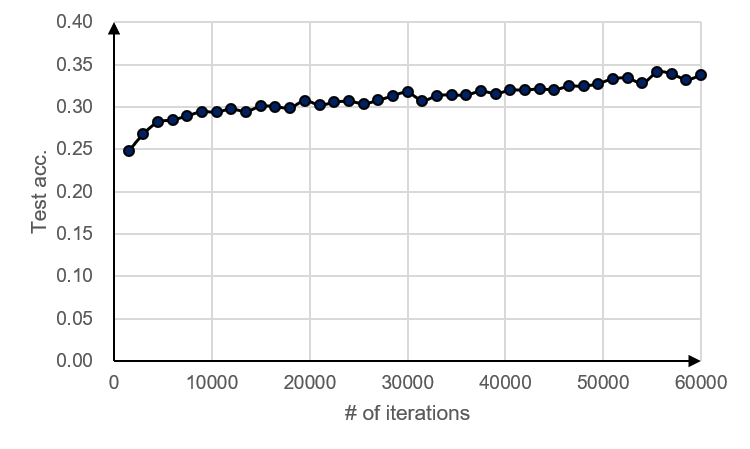

# MAML 
Unofficial Pytorch implementation of [Model-Agnostic Meta-Learning (MAML) for Fast Adaptation of Deep Networks](https://arxiv.org/abs/1703.03400)


## Requirements
- python 3.6+
- torch 1.2+
- torchvision 0.2+
- dataset (I downloaded mini-imagenet images from the following github [link](https://github.com/cyvius96/prototypical-network-pytorch).)
- tqdm 4.32+


## Usage
### Training
I designed the MAML model in sklearn style. Note that, I copied the dataset generator from the [dragen1860 github repo](https://github.com/dragen1860/MAML-Pytorch/blob/master/MiniImagenet.py).
```python
import os
import torch
import torch.nn as nn

from dragen_imagenet import MiniImagenet
from base_models.conv4 import conv4
from maml import maml

# Set parameters.
n, k = 5, 1
num_inner_loop = 5
num_inner_loop_test = 10
inner_lr = 1e-2
outer_lr = 1e-4
num_batch = 4  # 2
max_iter = 60000
use_cuda = True

# Define model. You can use any neural network-based model.
model = conv4(image_size=84, num_channels=3, num_classes=n,
              hidden_dim=32, use_dropout=False)
# Define loss function.
loss_f = torch.nn.functional.cross_entropy
# Define MAML.
maml_model = maml(n, k, model, loss_f, num_inner_loop, inner_lr, outer_lr, use_cuda)
# Load training dataset.
tr_dataset = MiniImagenet(batchsz=max_iter // 10)
# Fit the model according to the given dataset.
maml_model.fit(tr_dataset, num_batch)
```

### Test
```python
# Load test dataset.
ts_dataset = MiniImagenet(batchsz=600, mode="test")
maml_model.eval()
# Predict and calculate accuracy.
acc = maml_model.prediction_acc(ts_dataset, num_inner_loop_test)
```

### Modification to ANIL
The Almost No Inner Loop (ANIL) is a recently introduced model (see ref. 3). The model removes the inner loop for all but the last layer of the base model. My MAML implementation can be simply extended to ANIL by modifying the 24th and 63rd lines of maml.py. By changing the line 24 to `self.weight_name = [name for name, _ in list(self.model.named_parameters()[-2:]])` and line 63 to `list(self.model.parameters())[-2:],`, our code becomes ANIL.


## Results
Note that, I set the parameter outer_lr to 1e-4, which was set to 1e-3 in the original paper. With my code, the model is unstable when the outer_lr is 1e-3. This result was also observed in the [previous work](https://arxiv.org/abs/1810.09502). By reducing the outer_lr, the model can be trained reliably. I did not get the same performance, but I expect that increasing the number of iterations leads to the same performance.

### MiniImagenet 5-way 1-shot.
|                          | Test Acc. |
|--------------------------|-----------|
| MAML (paper)             | 48.70     |
| MAML (my implementation) | 33.79     |

### Test accuracy according to the number of iterations.


## References
1. Finn, C., Abbeel, P., & Levine, S. (2017). Model-agnostic meta-learning for fast adaptation of deep networks. ICML.
2. Antoniou, A., Edwards, H., & Storkey, A. (2018). How to train your MAML. ICLR.
3. Raghu, A., Raghu, M., Bengio, S., & Vinyals, O. (2019). Rapid learning or feature reuse? towards understanding the effectiveness of MAML. arXiv preprint arXiv:1909.09157.
